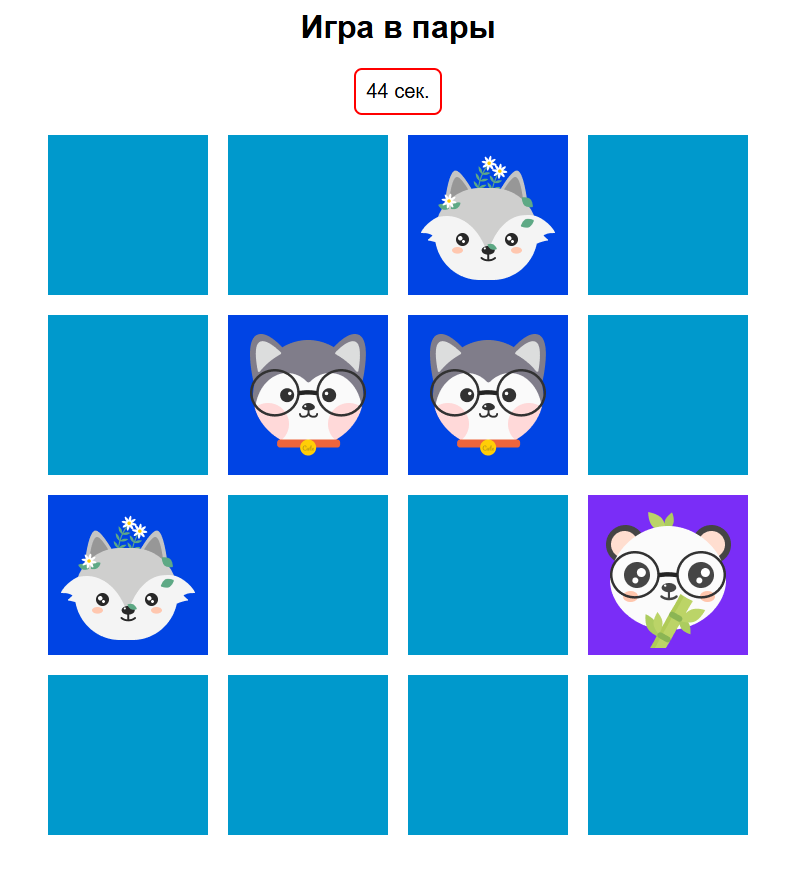

# Играв в пары

Игрок видит квадратное поле из карточек, расположенных рубашкой вверх, и находит пары, открывая карточки в произвольном порядке. На открытых карточках картинки. Игрок открывает сначала одну карточку, затем вторую. Если открытые карточки одинаковы, они остаются открытыми до конца партии. В противном случае они переворачиваются обратно.

Как только игрок открыл все пары на поле, игра считается завершённой. Под полем с открытыми карточками появляется кнопка «Сыграть ещё раз», при нажатии на которую игра сбрасывается до начального состояния с заново перемешанными карточками.

**Запуск:** с помощью расширения Open Whith Live Server Vscode
